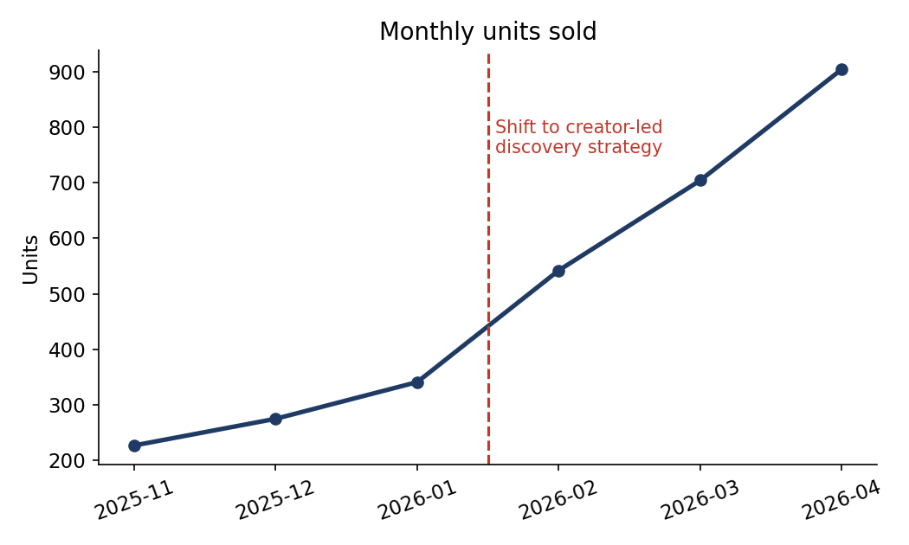

# From Demand Problem to Discovery Problem

A TikTok Shop case study in letting data challenge assumptions.

**TL;DR:** We sold a spicy dried fish snack and assumed demand came only from customers already familiar with the product. Sales and customer acquisition data showed the opposite: most buyers were new to the product and had discovered it through TikTok creators. The real bottleneck was discovery, not demand. We shifted marketing spend toward creator led discovery and growth accelerated.

> **A note on data:** no real customer, order, or supplier records are shared in this repo. The business level aggregates mentioned here (16,000+ units sold, nearly 10,000 TikTok followers) are real figures from the business. The order level dataset, the charts, and the month by month figures are synthetic and illustrative: they reproduce the shape of what the actual analysis found. What matters here is the reasoning, not the rows.

## Background

In 2023 I co founded Chitaro Mart, a self funded e commerce business selling Asian snacks on TikTok Shop. Over two and a half years the business sold 16,000+ units and grew to nearly 10,000 TikTok followers. I owned the analytics function end to end: defining KPIs, cleaning and analyzing sales, customer, return, and inventory data, and turning findings into decisions.

One of our products was a spicy dried fish snack. It was doing fine, but I believed its ceiling was low.

## The hypothesis

My working assumption was simple: this is a niche product. Demand comes from customers who already know and like it. People unfamiliar with it will not buy it, so marketing should target the familiar audience and we should not expect much growth beyond them.

If that hypothesis were true, the buyer base should skew heavily toward repeat or familiar customers, and acquisition channels should be dominated by search and repeat purchase.

## The data

I pulled order level data across six months and tagged each order with two attributes:

* **Customer familiarity:** was this buyer already familiar with the product category, or new to it?
* **Acquisition channel:** how did they arrive, TikTok creator content, search, referral, or repeat purchase?

Then I asked three questions:

1. Who is actually buying, familiar customers or new ones?
2. How did the new buyers find us?
3. What happened to the trend after we acted on the answers?

The full walkthrough is in [`notebooks/discovery_analysis.ipynb`](notebooks/discovery_analysis.ipynb), using the illustrative dataset in [`data/sample_orders.csv`](data/sample_orders.csv).

## The findings

**Finding 1: most buyers were new to the product.**

The majority of orders came from customers trying the product for the first time. My hypothesis was wrong at the first hurdle.

**Finding 2: new buyers arrived through TikTok creators.**

Roughly seven in ten new buyers discovered the product through TikTok creator content, not search. Familiar buyers behaved as expected, arriving mostly via search and repeat purchase. The two segments lived in completely different acquisition worlds.

**Finding 3: the problem was discovery, not demand.**

Put together, the picture was clear. Demand existed well beyond the familiar audience. The bottleneck was that unfamiliar customers simply never encountered the product. Creators were already doing the discovery work organically. We were underinvesting in the exact channel that was bringing in new buyers.

## The decision

We stopped treating this as a niche product for a niche audience. Marketing resources shifted toward creator led discovery: expanding creator partnerships, prioritizing products with creator momentum in merchandising, and measuring creator driven acquisition as a first class KPI instead of a side metric.

## The result

After the shift, growth in this product line accelerated and the broader business continued to scale, ultimately reaching 16,000+ units sold and nearly 10,000 TikTok followers. The deeper win was a change in how we made decisions: every product since then started with the question "what does the data say about who is actually buying?" rather than "who do we assume is buying?"

## What I took away

* **Write the hypothesis down before you query.** If I had not stated my assumption explicitly, I could have easily read the same data as confirmation that "the niche audience loves us."
* **Segment before you summarize.** Overall averages hid the story. Splitting buyers by familiarity and channel is what surfaced it.
* **Let the data reframe the problem.** The highest value analysis is not the one that answers the question well, it is the one that shows you were asking the wrong question.

## Tools

Python (pandas, matplotlib), SQL style aggregation, Excel and Tableau for the original business dashboards.

## About me

Chen Liu, BBA in Statistics and Quantitative Modeling (Baruch College, GPA 3.75), incoming MSE in Data Science at the University of Pennsylvania. Two and a half years as co founder of a TikTok Shop business, doing everything from SQL queries to creator partnerships. Open to data analyst roles in NYC or remote.
