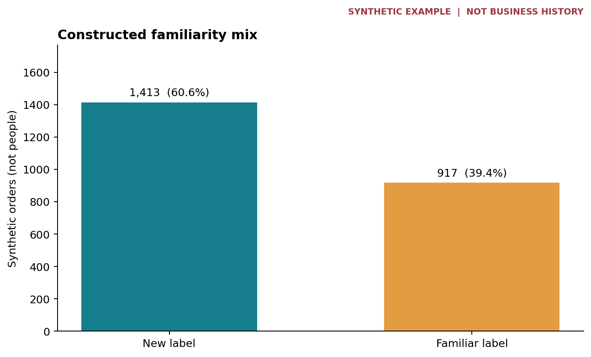
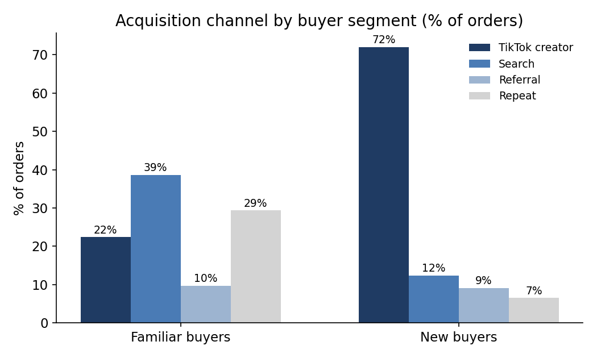
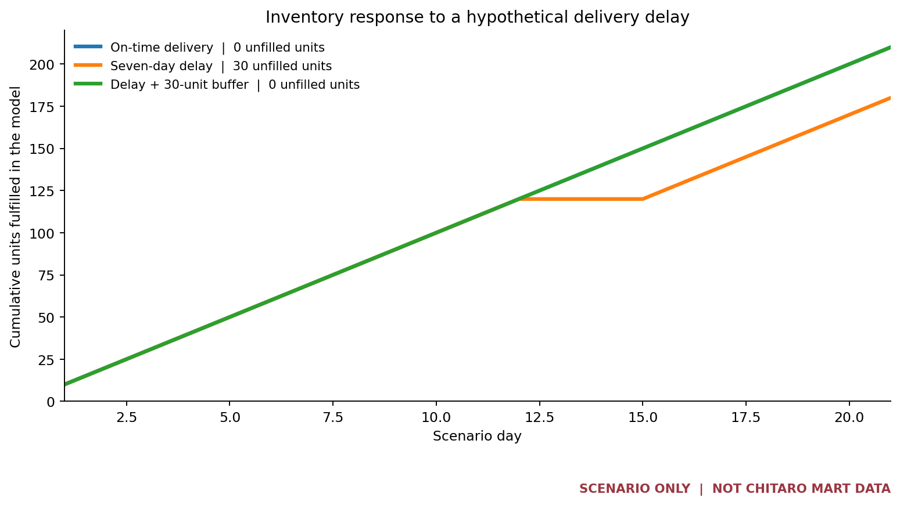

# Spicy fish, discovery, and the risk we missed

### A small business case study in asking a better question twice

> **True account, synthetic examples.** I co-founded Chitaro Mart, a TikTok Shop business selling Asian snacks. Our business-wide totals exceeded 16,000 units and approached 10,000 followers. We ultimately closed after weather-related disruption. These facts are drawn from my account; the public order sample and inventory model below are fabricated demonstrations. The repository contains no customer records or measured weather losses.

## The first question: was there demand outside the familiar audience?

I assumed a spicy dried fish snack would have a narrow audience of people who already knew the product. Reviewing sales and customer patterns challenged that view: customers from different backgrounds were discovering it through TikTok creators. We broadened our creator-led product discovery strategy. The business grew, but I cannot isolate the contribution of that change from the other decisions we made. The 16,000-plus units and follower total refer to the **whole business**, not this product or a measured campaign effect.

To demonstrate the segmentation logic without exposing customer data, the repository includes a **synthetic** order sample. In its 2,330 fabricated rows, 60.6% of orders carry a constructed `new` familiarity label. Within that group, 72.0% carry a `tiktok_creator` source label. These are **order shares in an example**, not real customer shares, creator attribution, or evidence for a causal effect.





There is an important data quality warning: 92 sample rows carry both `new` and `repeat_purchase`. The original generator and definitions are unavailable. I therefore report labels as given and **do not call them verified first-time buyers**. Details are in [data/README.md](data/README.md).

## The second question: what happens when operations fail?

The business later closed after weather-related disruption. The public records in this repository do not establish its precise mechanism, timeline, dollar cost, or what intervention might have prevented closure. That is exactly the limitation I want this case study to confront. A finding about demand does not provide a forecast of external risk or a resilience plan.

I built a *separate, hypothetical* delivery-delay stress test to make the next analytical question concrete. It is **not a reconstruction** of the weather event. Its deliberately simple assumptions are 10 units demanded each day for 21 days, 120 units on hand, and 100 more due on day 9. A seven-day delay creates 30 unfilled units in the model; adding 30 opening units removes those unfilled units but requires holding the extra stock. This is a scenario calculation, **not an estimate of our actual losses or an optimal stocking policy**.



| Model outcome | On-time delivery | Seven-day delay | Delay with 30 extra opening units |
| --- | ---: | ---: | ---: |
| Units fulfilled in 21 days | 210 | 180 | 210 |
| Units unfilled | 0 | 30 | 0 |
| Initial inventory units | 120 | 120 | 150 |

**Sensitivity to assumptions:** The number of unfilled units changes when the hypothetical delay or opening inventory changes. These are modeled units, not estimated historical losses.

| Delivery delay | 120 opening units | 135 opening units | 150 opening units |
| --- | ---: | ---: | ---: |
| 0 days | 0 | 0 | 0 |
| 3 days | 0 | 0 | 0 |
| 7 days | 30 | 15 | 0 |
| 10 days | 60 | 45 | 30 |

The model omits demand variability, multiple deliveries, spoilage, storage cost, cash constraints, supplier alternatives, and the event's actual cause. More inventory could be expensive or impossible for a small business. In a real decision I would compare the cost and cash tied up in a buffer against service levels across several delay and demand assumptions, then monitor inventory coverage and supplier lead times. Without dated operational and weather records, I cannot fit or validate a weather forecast or estimate a counterfactual outcome.

## What I would do differently

1. **Keep the useful discovery insight.** Define product-level outcomes and distinguish creator exposure from an order-source label. Compare a test or credible baseline before attributing growth to a marketing change.
2. **Make risk visible alongside growth.** Monitor days of inventory cover, inbound lead times, fulfillment delays and supplier concentration. Give each metric an owner and a response threshold.
3. **Stress test before committing cash.** Evaluate several lead-time, demand and buffer assumptions; include carrying cost, shelf life and liquidity. Choose a response that the business can actually fund.
4. **Record events and review misses.** Capture dated disruptions and decisions, then test whether earlier warnings would have offered useful lead time. A neat upward historical curve is not proof that tomorrow will be safe.

These are proposed improvements informed by the closure, **not work I claim to have completed while running the business**.

## Reproduce every public calculation

With Python 3.10 or newer, from the repository root:

```bash
python -m pip install -r requirements.txt
python scripts/analyze.py
python scripts/scenario.py
```

`analyze.py` validates the provided CSV and regenerates the two order illustrations. `scenario.py` generates the stress test from explicit assumptions in its `Assumptions` class. The [executed notebook](notebooks/discovery_analysis.ipynb) walks through the questions and computed results. [SQL examples](sql/analysis.sql) reproduce the order aggregations in SQLite. [Data documentation](data/README.md) describes the sample, its provenance gaps and prohibited interpretations. No confidential customer or supplier data are published.

## Author

Chris (Chen) Liu · BBA in Statistics and Quantitative Modeling, Baruch College · Incoming MSE in Data Science, University of Pennsylvania. I built this case to show both a useful business insight and how the end of the business changed the questions I ask of data.
